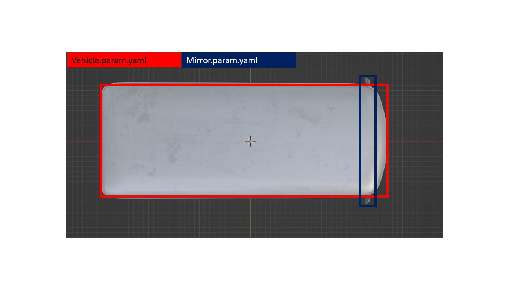

# Carla_t2
Carla_T2 Sensor Kit and Vehicle Model for Autoware Universe

# You can find the README here: [CARLA-Autoware-Bridge](https://github.com/TUMFTM/Carla-Autoware-Bridge)

## Paper
If you use this or the other associated repos, please cite our Paper:

**CARLA-Autoware-Bridge: Facilitating Autonomous Driving Research
with a Unified Framework for Simulation and Module Development** Gemb Kaljavesi, Tobias Kerbl, Tobias Betz, Kirill Mitkovskii, Frank Diermeyer [[PDF]()]

## Vehicle Parameter
The parameterized boxes have been visualized for better understanding

